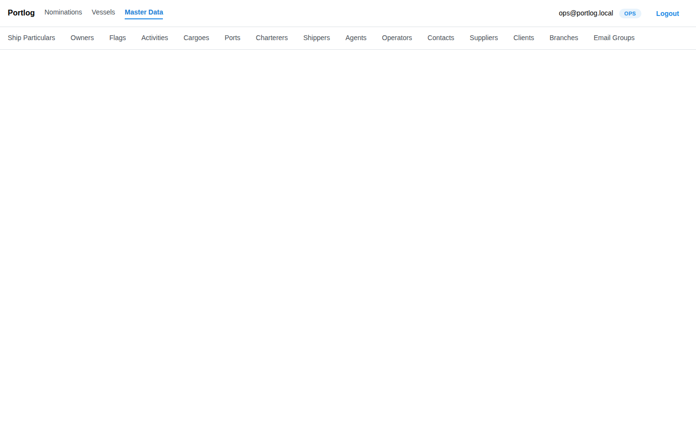

---
# Portlog — Manual de Usuario de Datos Maestros

Los Datos Maestros son la capa de referencia de la que depende todo lo demás en Portlog. Los buques, puertos, propietarios, operadores, sucursales y grupos de correo se definen aquí. Configurarlos correctamente permite que el resto del sistema funcione con naturalidad.
---

## Tabla de Contenidos

1. [Navegar por Datos Maestros](#1-navegar-por-datos-maestros)
2. [Patrón de Interfaz Común](#2-patrón-de-interfaz-común)
3. [Características del Buque (Embarcaciones)](#3-características-del-buque-embarcaciones)
4. [Puertos](#4-puertos)
5. [Sucursales](#5-sucursales)
6. [Propietarios](#6-propietarios)
7. [Operadores](#7-operadores)
8. [Clientes](#8-clientes)
9. [Contactos](#9-contactos)
10. [Grupos de Correo](#10-grupos-de-correo)
11. [Banderas](#11-banderas)
12. [Actividades](#12-actividades)
13. [Cargas](#13-cargas)
14. [Agentes](#14-agentes)
15. [Fletadores](#15-fletadores)
16. [Embarcadores](#16-embarcadores)
17. [Proveedores](#17-proveedores)
18. [Resumen de Permisos](#18-resumen-de-permisos)

---

## 1. Navegar por Datos Maestros

Haga clic en **Master Data** en la barra de navegación superior para abrir el módulo. Aparece una segunda barra de pestañas debajo de la navegación principal con los 14 tipos de entidades.

Haga clic en cualquier pestaña para abrir esa entidad. La página redirige a un formulario vacío listo para un nuevo registro, o haga clic en un nombre en la lista de la izquierda para cargar un registro existente.

---

## 2. Patrón de Interfaz Común

Casi todas las entidades en Datos Maestros utilizan el mismo diseño de dos paneles.

**Panel izquierdo — lista**

- Todos los registros ordenados alfabéticamente por nombre
- Campo **FLASH SEARCH** en la parte superior — escriba para filtrar la lista al instante
- Haga clic en cualquier nombre para cargarlo en el panel derecho

**Panel derecho — formulario + barra de botones**

La barra de botones en la parte superior del panel derecho es la misma en todas las entidades:

| Botón      | Acción                                            |
| ---------- | ------------------------------------------------- |
| **Print**  | Imprime el registro actual                        |
| **Prior**  | Carga el registro anterior en la lista            |
| **Next**   | Carga el siguiente registro en la lista           |
| **First**  | Salta al primer registro                          |
| **Last**   | Salta al último registro                          |
| **New**    | Limpia el formulario para crear un nuevo registro |
| **Cancel** | Descarta los cambios no guardados                 |
| **Accept** | Guarda el registro actual                         |

> Los **campos obligatorios** están marcados con un asterisco rojo `*`. El botón **Accept** permanece deshabilitado hasta que todos los campos obligatorios estén completados.

---

## 3. Características del Buque (Embarcaciones)

El registro de embarcaciones. Cada nominación hace referencia a una Característica del Buque, por lo que este es el punto de partida cuando se necesita agregar una nueva embarcación.

### Campos

| Campo                     | Obligatorio | Notas                                                       |
| ------------------------- | ----------- | ----------------------------------------------------------- |
| **Name**                  | Sí          | Nombre completo del buque (p. ej., MV Liberian Star)        |
| **Abbreviation**          | No          | Identificador abreviado (p. ej., LBSTAR)                    |
| **Call Sign**             | No          | Alfanumérico en mayúsculas, 3–15 caracteres; debe ser único |
| **IMO Number**            | No          | Exactamente 7 dígitos; debe ser único                       |
| **Flag**                  | Sí          | Seleccionar de la lista de Banderas                         |
| **Owner**                 | No          | Seleccionar de la lista de Propietarios                     |
| **Operator**              | No          | Seleccionar de la lista de Operadores                       |
| **LOA (m)**               | No          | Eslora total en metros                                      |
| **DWT**                   | No          | Peso Muerto                                                 |
| **GRT**                   | No          | Arqueo Bruto                                                |
| **NRT**                   | No          | Arqueo Neto                                                 |
| **Email**                 | No          | Dirección de correo del buque                               |
| **Phone / Phone 2 / Fax** | No          | Números de contacto                                         |
| **Comments**              | No          | Notas internas                                              |

### Actualización desde Datalastic (Consulta AIS)

Cuando se ingresa un IMO válido de 7 dígitos que difiere del valor guardado, aparece el botón **Refresh from Datalastic**. Haga clic para obtener los últimos datos del buque desde el proveedor AIS — nombre, señal de llamada, dimensiones y bandera se completan automáticamente con el resultado. Revise los valores y haga clic en **Accept** para guardar.

### Agregar un Nuevo Buque

1. Haga clic en la pestaña **Ship Particulars**.
2. Haga clic en **New** en la barra de botones.
3. Ingrese el nombre y seleccione la bandera (obligatorio).
4. Agregue el número IMO si está disponible — esto habilita la actualización desde Datalastic.
5. Vincule el propietario y el operador si los conoce.
6. Haga clic en **Accept**.

---

## 4. Puertos

Instalaciones portuarias donde recalan los buques. Cada puerto puede tener múltiples **Muelles** (atraques/terminales).

### Campos

| Campo           | Obligatorio | Notas                                                                           |
| --------------- | ----------- | ------------------------------------------------------------------------------- |
| **Name**        | Sí          | Nombre completo del puerto                                                      |
| **Acronym**     | No          | Código abreviado utilizado en toda la aplicación (p. ej., NPA, MVD)             |
| **Country**     | No          | País o región                                                                   |
| **Email Group** | No          | Grupo de correo predeterminado para los destinatarios de la autoridad portuaria |
| **Comentarios** | No          | Notas internas                                                                  |

### Gestión de Muelles

Debajo de los campos del puerto, la sección **Muelles** lista todos los atraques/terminales de este puerto:

- **Agregar un muelle** — escriba un nombre en el campo "New pier name…" y haga clic en **+** (o presione Enter)
- **Eliminar un muelle** — haga clic en la **×** roja junto a su nombre
- Los cambios en los muelles se guardan en conjunto al hacer clic en **Accept**

### Agregar un Nuevo Puerto

1. Haga clic en la pestaña **Ports**.
2. Haga clic en **New**.
3. Ingrese el nombre (obligatorio) y el acrónimo.
4. Agregue el país y el grupo de correo si los conoce.
5. Agregue los muelles según sea necesario.
6. Haga clic en **Accept**.

---

## 5. Sucursales

Ubicaciones de sucursales/oficinas de la empresa. La sucursal determina qué documentos de sucursal están disponibles en una nominación y qué plantillas utiliza la agencia.

### Campos

| Campo        | Obligatorio | Notas                                                                             |
| ------------ | ----------- | --------------------------------------------------------------------------------- |
| **Name**     | Sí          | Nombre completo de la sucursal (p. ej., Nueva Palmira Branch)                     |
| **Code**     | Sí          | Código abreviado único (p. ej., NPA); se utiliza en las referencias de nominación |
| **Comments** | No          | Notas internas                                                                    |

La lista muestra cada sucursal como **CÓDIGO — Nombre** para una identificación rápida.

### Agregar una Nueva Sucursal

1. Haga clic en la pestaña **Branches**.
2. Haga clic en **New**.
3. Ingrese el nombre y el código (ambos obligatorios). El código debe ser único.
4. Haga clic en **Accept**.

---

## 6. Propietarios

Propietarios de buques. Incluye campos CRM para la gestión de relaciones y datos financieros con acceso restringido por permisos.

### Campos

**Bloque de contacto**

| Campo                        | Notas                                          |
| ---------------------------- | ---------------------------------------------- |
| **Name**                     | Nombre de la empresa propietaria (obligatorio) |
| **Physical Address**         | Dirección física de la oficina                 |
| **Address (correspondence)** | Dirección postal si es diferente               |
| **Phones**                   | Números de teléfono (texto libre)              |
| **Contact Number**           | Número de contacto principal                   |
| **Contact List**             | Nombre de la persona de contacto o lista       |

**Bloque CRM** (desplácese hacia abajo para ver)

| Campo               | Notas                                 |
| ------------------- | ------------------------------------- |
| **Birthday**        | Cumpleaños del contacto (texto libre) |
| **Preferences**     | Preferencias personales e intereses   |
| **Recommendations** | Notas sobre el manejo recomendado     |
| **Business**        | Antecedentes comerciales y notas      |
| **Webpage**         | URL del sitio web del propietario     |

**Bloque financiero** (visible solo con el permiso `owner.financial`)

| Campo          | Notas                                                                            |
| -------------- | -------------------------------------------------------------------------------- |
| **Agreements** | Términos del acuerdo financiero                                                  |
| **History**    | JSON con seguimiento del historial del buque, tickets abiertos, facturas y pagos |

Los usuarios sin el permiso `owner.financial` verán un cuadro de alerta amarillo en lugar de estos dos campos.

---

## 7. Operadores

Operadores de buques — empresas que gestionan las operaciones diarias de la embarcación.

### Campos

| Campo                     | Notas                                                                                   |
| ------------------------- | --------------------------------------------------------------------------------------- |
| **Name**                  | Nombre de la empresa operadora (obligatorio)                                            |
| **Email**                 | Correo electrónico de contacto principal                                                |
| **Business Phone / Fax**  | Números de contacto                                                                     |
| **Address**               | Dirección postal completa                                                               |
| **Standard Requirements** | Documentación requerida o notas de cumplimiento para este operador                      |
| **Send Copy**             | Si está marcado, este operador recibe copia automáticamente en los documentos salientes |
| **Location**              | **L** (Local) o **E** (Exterior) — indica base local o internacional                    |
| **Comments**              | Notas internas                                                                          |

---

## 8. Clientes

Clientes de la agencia portuaria — empresas a las que la sucursal presta servicios. Incluye múltiples tipos de dirección y una tabla de tarifas en línea.

### Campos

**Información básica**

| Campo             | Notas                                      |
| ----------------- | ------------------------------------------ |
| **Name**          | Nombre de la empresa cliente (obligatorio) |
| **Tel. / Tel. 2** | Teléfono principal y secundario            |

**Direcciones** — cada una tiene un botón **Copy Physical** para duplicar la dirección física:

- Dirección Física
- Dirección de Facturación
- Dirección Postal
- Dirección Fiscal
- Otra Dirección

**Contacto**

| Campo           | Notas                                                    |
| --------------- | -------------------------------------------------------- |
| **Fax**         | Número de fax                                            |
| **Mobile**      | Teléfono celular                                         |
| **EMail**       | Correo electrónico principal                             |
| **EMail Group** | Referencia a un grupo de correo para distribución masiva |

**Tabla de tarifas del cliente**

Una tabla editable en línea para precios específicos de cada cliente:

| Columna         | Notas                          |
| --------------- | ------------------------------ |
| **#**           | Fila numerada automáticamente  |
| **Item**        | Nombre del servicio o producto |
| **Amount**      | Precio o costo                 |
| **Information** | Notas adicionales              |

Haga clic en **Insert new row** para agregar una línea de tarifa. Haga clic en el ícono **×** de una fila para eliminarla. Todos los cambios se guardan junto con el cliente al hacer clic en **Accept**.

**Instructions** — notas sobre manejo especial o servicio para este cliente.

---

## 9. Contactos

Directorio de contactos individuales. Cada contacto puede estar vinculado a una organización (Embarcador, Operador, Propietario o Fletador).

### Campos

| Campo              | Notas                                          |
| ------------------ | ---------------------------------------------- |
| **Name**           | Nombre de la persona de contacto (obligatorio) |
| **Email**          | Dirección de correo electrónico                |
| **Home Phone**     | Teléfono particular                            |
| **Mobile**         | Número de celular                              |
| **Business Phone** | Teléfono comercial                             |
| **Business Fax**   | Fax comercial                                  |
| **Address**        | Dirección postal completa                      |
| **Comments**       | Notas internas                                 |

### Vinculación a una Organización

El control segmentado **Link to** en la parte inferior determina con qué empresa está asociado este contacto:

| Opción        | Efecto                                                                |
| ------------- | --------------------------------------------------------------------- |
| **Shipper**   | Muestra un selector de Embarcador — seleccione la empresa embarcadora |
| **Operator**  | Muestra un selector de Operador                                       |
| **Owner**     | Muestra un selector de Propietario                                    |
| **Charterer** | Muestra un selector de Fletador                                       |
| **None**      | El contacto queda sin vincular (predeterminado)                       |

> Solo se puede seleccionar una organización por contacto. Cambiar de categoría borra la selección anterior.

---

## 10. Grupos de Correo

Listas de distribución utilizadas como grupos de destinatarios en el despacho de documentos. Los grupos pueden asignarse a puertos y clientes, y seleccionarse como destinatarios al redactar correos.

### Campos

| Campo           | Notas                                     |
| --------------- | ----------------------------------------- |
| **Name**        | Nombre del grupo (obligatorio)            |
| **Description** | Breve descripción del propósito del grupo |
| **Comments**    | Notas internas                            |

### Gestión de Miembros

**Pegado masivo** — pegue direcciones de correo separadas por punto y coma en el campo "Paste emails (semicolons)". Las direcciones inválidas se omiten.

**Agregar manualmente** — haga clic en **+ Add row** para insertar una fila en blanco y luego complete:

- **Email** — dirección de correo válida (obligatorio por fila)
- **Display Name** — etiqueta descriptiva opcional que se muestra en las listas de destinatarios

Haga clic en la **×** de una fila para eliminar un miembro. Haga clic en **Accept** para guardar todos los cambios.

---

## 11. Banderas

Códigos de bandera de países para el registro de embarcaciones.

### Campos

| Campo            | Notas                                                      |
| ---------------- | ---------------------------------------------------------- |
| **Name**         | Nombre del país (obligatorio, p. ej., "Panama", "Liberia") |
| **Abbreviation** | Código ISO o código personalizado (p. ej., "PA")           |
| **Comments**     | Notas internas                                             |

---

## 12. Actividades

Tipos de actividad utilizados en la planilla SOF (Statement of Facts). Al construir un SOF, cada fila de la planilla hace referencia a uno de estos códigos de actividad.

### Campos

| Campo        | Notas                                                                        |
| ------------ | ---------------------------------------------------------------------------- |
| **Name**     | Nombre del tipo de actividad (obligatorio, p. ej., "Loading", "Discharging") |
| **Comments** | Notas internas                                                               |

---

## 13. Cargas

Catálogo de tipos de carga.

### Campos

| Campo        | Notas                                                            |
| ------------ | ---------------------------------------------------------------- |
| **Name**     | Nombre de la carga (obligatorio, p. ej., "Soja", "Maíz")         |
| **BBL Unit** | Unidad de medida: **BBL**, **MT**, **KG** o **LT** (obligatorio) |
| **Comments** | Notas internas                                                   |

---

## 14. Agentes

Agentes portuarios y proveedores de servicios marítimos.

### Campos

| Campo            | Notas                                           |
| ---------------- | ----------------------------------------------- |
| **Name**         | Nombre de la empresa agente (obligatorio)       |
| **Address**      | Dirección postal completa                       |
| **Contact Info** | Correo, teléfono, fax y otros datos de contacto |
| **Comments**     | Notas internas                                  |

---

## 15. Fletadores

Fletadores de buques — empresas que contratan embarcaciones.

### Campos

| Campo            | Notas                                           |
| ---------------- | ----------------------------------------------- |
| **Name**         | Nombre de la empresa fletadora (obligatorio)    |
| **Address**      | Dirección postal completa                       |
| **Contact Info** | Correo, teléfono, fax y otros datos de contacto |
| **Comments**     | Notas internas                                  |

---

## 16. Embarcadores

Empresas que envían carga en buques.

### Campos

| Campo              | Notas                                          |
| ------------------ | ---------------------------------------------- |
| **Name**           | Nombre de la empresa embarcadora (obligatorio) |
| **Email**          | Correo electrónico principal                   |
| **Business Phone** | Teléfono principal                             |
| **Business Fax**   | Número de fax                                  |
| **Address**        | Dirección postal completa                      |
| **Comments**       | Notas internas                                 |

---

## 17. Proveedores

Prestadores de servicios y contratistas (Proveedores).

### Campos

| Campo                | Notas                                                      |
| -------------------- | ---------------------------------------------------------- |
| **Name**             | Nombre de la empresa proveedora (obligatorio)              |
| **Address**          | Dirección postal completa                                  |
| **Services**         | Descripción de los servicios prestados                     |
| **KYC**              | Notas de cumplimiento Know-Your-Customer                   |
| **Phones / Emails**  | Información de contacto                                    |
| **Certificates**     | Referencias a certificaciones y documentos de cumplimiento |
| **Rates**            | Tarifarios y precios                                       |
| **Service Contract** | Términos y referencias del contrato de servicio            |
| **Agreements**       | Acuerdos secundarios y MOU                                 |
| **Contacts**         | Personas de contacto clave                                 |
| **Comments**         | Notas internas                                             |

---

## 18. Resumen de Permisos

| Acción                             | OPS | ADM  |
| ---------------------------------- | --- | ---- |
| Ver lista                          | ✓   | ✓    |
| Buscar                             | ✓   | ✓    |
| Ver detalle del registro           | ✓   | ✓    |
| Crear nuevo registro               | ✓   | ✓    |
| Editar registro                    | ✓   | ✓    |
| Eliminar registro                  | —   | ✓    |
| Campos financieros del propietario | —   | ✓ \* |
| Escritura en Grupos de Correo      | ✓   | ✓    |

\* El permiso `owner.financial` es un permiso de grano fino independiente del rol. Los usuarios ADM lo tienen por defecto; puede otorgarse a usuarios OPS de forma individual si fuera necesario.

---

## Tareas Comunes

### Encontrar un registro rápidamente

Escriba parte del nombre en el campo **FLASH SEARCH** del panel izquierdo. La lista se filtra al instante. Haga clic en el registro coincidente para cargarlo.

### Crear un nuevo registro

1. Haga clic en la pestaña de la entidad.
2. Haga clic en **New** en la barra de botones.
3. Complete los campos obligatorios (marcados con `*`).
4. Haga clic en **Accept**.

### Editar un registro existente

1. Seleccione el registro de la lista.
2. Modifique los campos en el panel derecho.
3. Haga clic en **Accept** para guardar.

### Cancelar cambios no guardados

Haga clic en **Cancel** en la barra de botones. Todos los cambios realizados desde el último guardado serán descartados.

### Navegar por registros sin usar la lista

Use **Prior** / **Next** para avanzar de a un registro a la vez, o **First** / **Last** para saltar al inicio o al final de la lista.

### Agregar un muelle a un puerto

1. Seleccione un puerto.
2. Desplácese hacia abajo hasta la sección **Muelles**.
3. Escriba el nombre del muelle en el campo "New pier name…".
4. Haga clic en **+** o presione Enter.
5. Haga clic en **Accept**.

### Crear un grupo de correo

1. Abra **Email Groups**.
2. Haga clic en **New**, ingrese un nombre.
3. Pegue correos separados por punto y coma en el campo de pegado — o haga clic en **+ Add row** para agregar miembros uno por uno.
4. Haga clic en **Accept**.
