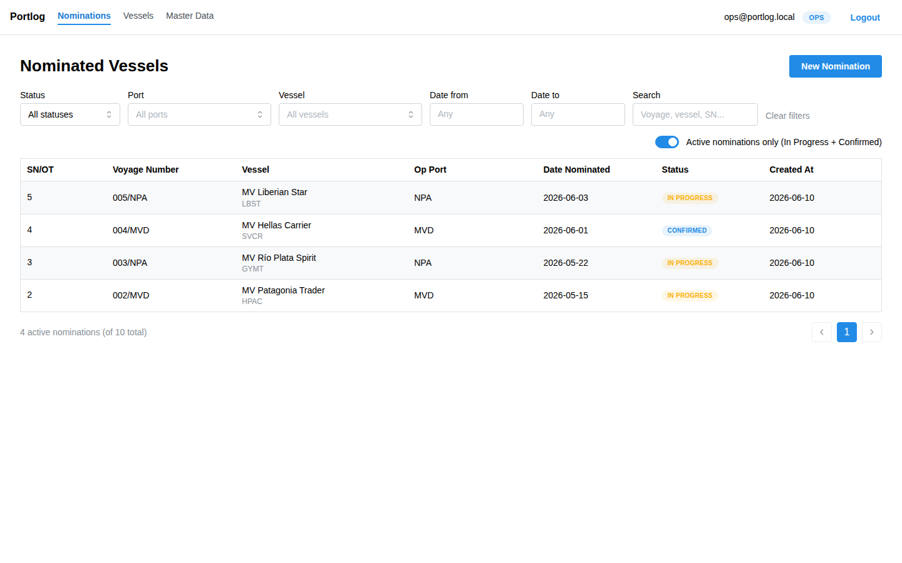
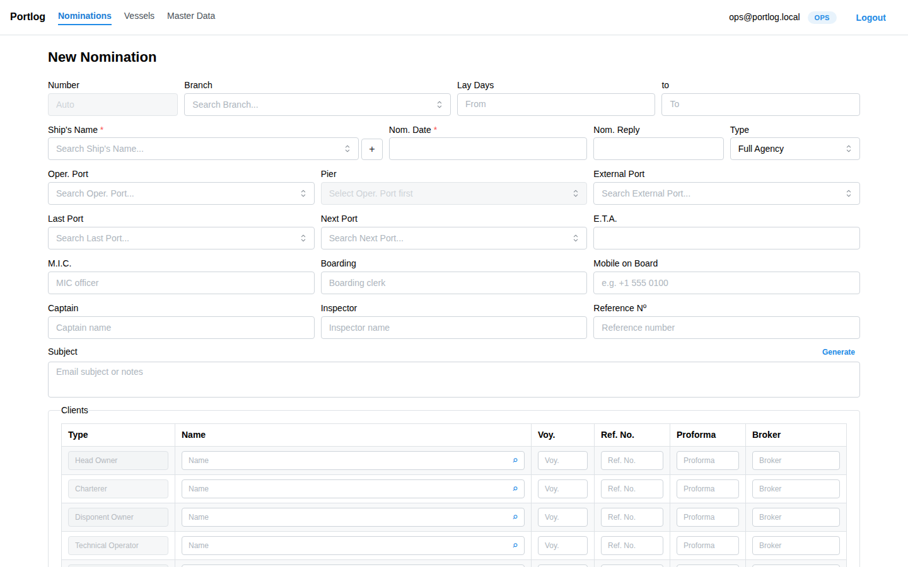
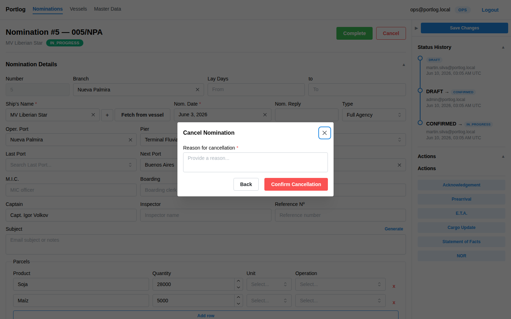
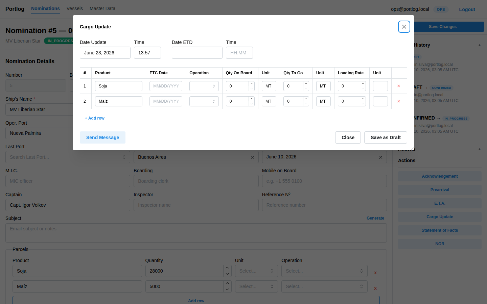
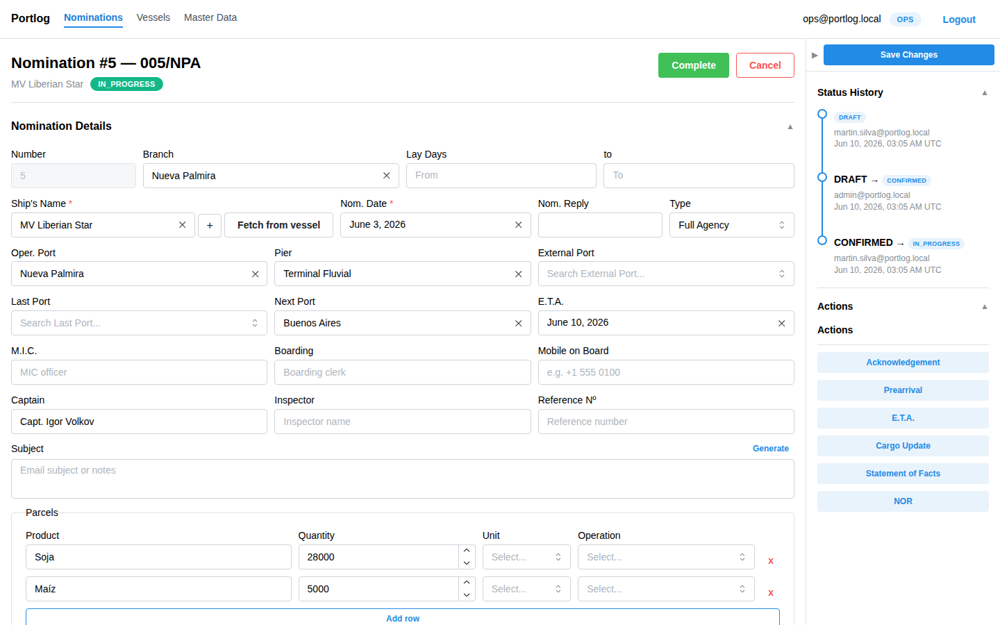
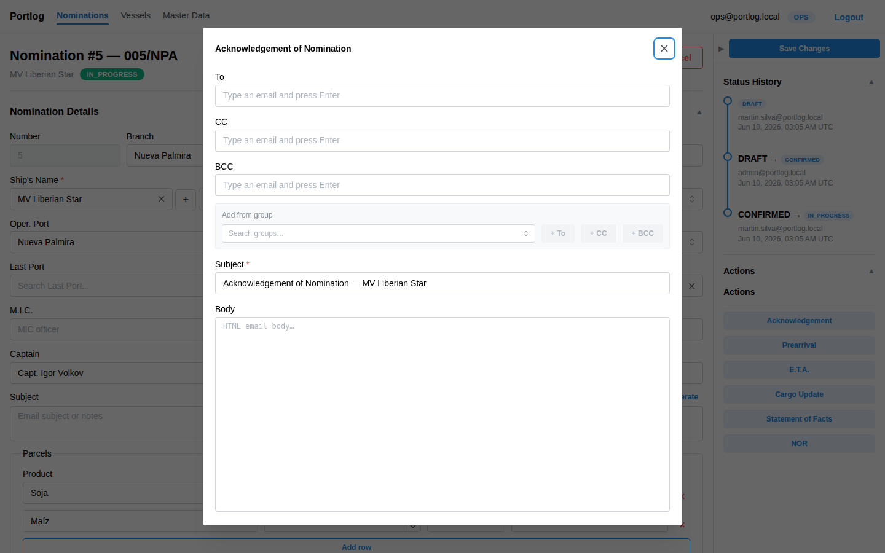
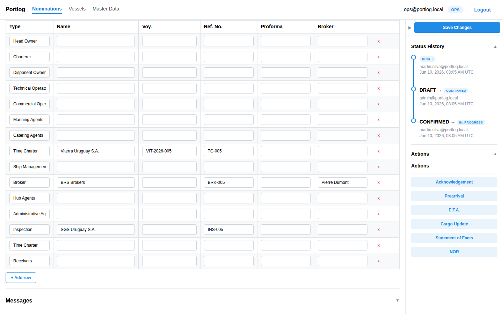

# Portlog — Nominations User Manual

This guide walks through the full lifecycle of a **Nomination** in Portlog: from initial creation through confirmation, progress tracking, and completion (or cancellation). Both roles — **OPS** and **ADM** — have full access to all steps described here.

---

## Table of Contents

1. [What is a Nomination?](#1-what-is-a-nomination)
2. [Nomination Lifecycle](#2-nomination-lifecycle)
3. [Viewing the Nominations List](#3-viewing-the-nominations-list)
4. [Creating a Nomination](#4-creating-a-nomination)
5. [Viewing a Nomination](#5-viewing-a-nomination)
6. [Editing a Nomination](#6-editing-a-nomination)
7. [Managing the Client List](#7-managing-the-client-list)
8. [Transitioning Status](#8-transitioning-status)
9. [Managing Cargo (Parcels)](#9-managing-cargo-parcels)
10. [Answering an ETA](#10-answering-an-eta)
11. [Sending Emails](#11-sending-emails)
12. [Viewing the Messages Log](#12-viewing-the-messages-log)
13. [Status History Audit Trail](#13-status-history-audit-trail)

---

## 1. What is a Nomination?

A **Nomination** represents a vessel's port call managed by the agency. It is the central record that links:

- The **vessel** (ship particulars) and its voyage details
- The **ports** involved (operating port, pier, last port, next port, discharge port)
- The **parties** involved (owners, charterers, broker, master, inspectors)
- The **cargo** being loaded or discharged (parcels)
- The **email recipients** for all outbound communications
- The **PEDR** (Port Entry/Departure Record), SH-xx port documents, and Statement of Facts

Every nomination is assigned a unique **SN number** (e.g., `5`) generated automatically on creation, used as `SN/OT` reference.

---

## 2. Nomination Lifecycle

A nomination moves through the following states. Only the transitions shown are allowed.

```
DRAFT
  ├─→ CONFIRMED     (action: Confirm)
  └─→ CANCELLED     (action: Cancel — reason required)

CONFIRMED
  ├─→ IN PROGRESS   (action: Start)
  └─→ CANCELLED     (action: Cancel — reason required)

IN PROGRESS
  ├─→ COMPLETED     (action: Complete)
  └─→ CANCELLED     (action: Cancel — reason required)

COMPLETED  ← terminal, no further changes allowed
CANCELLED  ← terminal, no further changes allowed
```

Status badges are color-coded throughout the app:

| Status      | Color        |
| ----------- | ------------ |
| Draft       | Gray         |
| Confirmed   | Blue         |
| In Progress | Orange/Amber |
| Completed   | Green        |
| Cancelled   | Red          |

---

## 3. Viewing the Nominations List

Navigate to **Nominations** in the top nav bar to reach the list page.



### Columns

| Column         | Description                       |
| -------------- | --------------------------------- |
| SN/OT          | Auto-generated number (e.g., 5)   |
| Voyage Number  | Voyage identifier (e.g., 005/NPA) |
| Vessel         | Vessel name and call sign         |
| Op Port        | Operating port code               |
| Date Nominated | Nomination date                   |
| Status         | Color-coded badge                 |
| Created At     | Record creation date              |

### Filtering and Search

The filter bar sits directly below the page title:

- **Status** — filter by one status (All statuses / Draft / Confirmed / In Progress / Completed / Cancelled)
- **Port** — filter by operating port
- **Vessel** — filter by ship name
- **Date from / Date to** — filter by nomination date range
- **Search** — free-text match on voyage number, vessel name, or SN reference

**"Active nominations only (In Progress + Confirmed)"** toggle (top-right, on by default) — hides COMPLETED, CANCELLED, and DRAFT records. Turn it off to see all 10 records.

Click **Clear filters** to reset all filters at once.

Pagination appears at the bottom right when there are more results than fit on one page.

---

## 4. Creating a Nomination

Click **New Nomination** (blue button, top-right of the list page) to open the create form.



### Required Fields

| Field           | Notes                                                              |
| --------------- | ------------------------------------------------------------------ |
| **Ship's Name** | Select from the vessel master list. Click **+** to add AIS lookup. |
| **Nom. Date**   | Nomination date (required).                                        |
| **Type**        | Defaults to **Full Agency**.                                       |

### Optional Fields — Voyage & Ports

| Field         | Notes                                                                       |
| ------------- | --------------------------------------------------------------------------- |
| Number        | Auto-assigned (shown as "Auto" until saved).                                |
| Branch        | Branch managing this nomination. Unlocks the Branch Documents panel.        |
| Lay Days      | From/To date range for lay days.                                            |
| Nom. Reply    | Date nomination was acknowledged.                                           |
| Oper. Port    | Primary operating port. Pier becomes available once Oper. Port is selected. |
| Pier          | Specific berth. Requires Oper. Port first.                                  |
| External Port | Alternate external port reference.                                          |
| Last Port     | Previous port of call.                                                      |
| Next Port     | Next port after this call.                                                  |
| E.T.A.        | Estimated Time of Arrival.                                                  |

### Optional Fields — People

| Field           | Notes                 |
| --------------- | --------------------- |
| M.I.C.          | MIC officer code.     |
| Boarding        | Boarding clerk name.  |
| Mobile on Board | Vessel contact phone. |
| Captain         | Vessel master's name. |
| Inspector       | Port inspector name.  |
| Reference Nº    | Free-text reference.  |

### Subject

Optional email subject template. Click **Generate** to auto-fill from nomination data.

### Clients Table

The Clients table is pre-populated with default party types (Head Owner, Charterer, Disponent Owner, etc.). Fill in names and references for each relevant party. You can add extra rows or remove unused ones.

### Submitting

Scroll to the bottom and click **Create Nomination**. The nomination is created in **DRAFT** status and assigned its SN number. You are redirected to the detail page.

---

## 5. Viewing a Nomination

Click any row in the nominations list to open the detail page.


### Layout

**Header (top)**

- Nomination number and voyage number (e.g., **Nomination #5 — 005/NPA**)
- Vessel name and status badge below the title
- Status transition buttons at the top right (e.g., **Complete**, **Cancel**)

**Left panel (main content)**

- **Nomination Details** — collapsible form with all nomination fields and parcels
- **Clients** — collapsible client list table
- **Messages** — collapsible email dispatch log

**Right rail**

- **Save Changes** — blue button to persist edits
- **Status History** — collapsible audit trail
- **Actions** — email action buttons (Acknowledgement, Prearrival, E.T.A., Cargo Update, Statement of Facts, NOR)

---

## 6. Editing a Nomination

Nominations in **DRAFT**, **CONFIRMED**, or **IN PROGRESS** status can be edited. COMPLETED and CANCELLED nominations are read-only.


1. On the detail page the **Nomination Details** section is expanded by default — edit any field directly.
2. Click **Save Changes** (blue button in the right rail) to persist your changes.
3. The **▲/▼** arrow next to each section header collapses or expands it.

> If the nomination is in a terminal state (COMPLETED or CANCELLED), the Save Changes button is hidden and all fields become read-only.

---

## 7. Managing the Client List

The **Clients** section tracks all parties involved in the nomination.


### Columns

| Column   | Description                                   |
| -------- | --------------------------------------------- |
| Type     | Party type (read-only label for default rows) |
| Name     | Company or party name — click to edit         |
| Voy.     | Voyage reference for this party               |
| Ref. No. | Party's internal reference number             |
| Proforma | Proforma invoice number                       |
| Broker   | Associated broker name                        |

### Editing

All **Name**, **Voy.**, **Ref. No.**, **Proforma**, and **Broker** cells are editable — click a cell to edit, then press Tab or click away to save.

### Adding a Row

Click **+ Add row** at the bottom of the table. A blank row is appended with an empty Type field.

### Removing a Row

Click the red **×** at the end of the row.

> The full Client List (including rows with empty names) is saved automatically when you click **Save Changes** in the right rail.

---

## 8. Transitioning Status

Status transition buttons appear in the top-right of the nomination header.

### IN PROGRESS — Complete or Cancel


The buttons shown depend on current status:

| Status      | Buttons shown    |
| ----------- | ---------------- |
| Draft       | Confirm, Cancel  |
| Confirmed   | Start, Cancel    |
| In Progress | Complete, Cancel |
| Completed   | _(none)_         |
| Cancelled   | _(none)_         |

Click the primary action button (**Confirm**, **Start**, or **Complete**) to advance the nomination — no confirmation dialog is shown.

### Cancelling

Click **Cancel** at any active status. A modal appears:



1. Enter the **reason for cancellation** in the text area (required — cannot be left blank).
2. Click **Confirm Cancellation** to proceed — or **Back** to return without cancelling.

The reason is permanently stored in the Status History audit trail.

---

## 9. Managing Cargo (Parcels)

The **Parcels** section in the Nomination Details form holds the cargo rows. Each row represents one cargo lot.

### Inline Editing (on the nomination form)

Each parcel row has four columns: **Product**, **Quantity**, **Unit**, and **Operation**. Click **Add row** at the bottom of the Parcels section to add a new cargo lot, or click the red **×** to remove one.

### Cargo Update Modal

For in-progress cargo figures (completion times, quantities remaining, loading rates), use the **Cargo Update** action in the right rail:



Fill in for each parcel:

| Field              | Description                                  |
| ------------------ | -------------------------------------------- |
| Date Update / Time | When this update was recorded                |
| Date ETD / Time    | Estimated time of departure                  |
| ETC Date           | Estimated Time of Completion for this parcel |
| Qty On Board       | Remaining quantity on board                  |
| Qty To Go          | Quantity yet to discharge                    |
| Loading Rate       | Operational loading/discharge rate           |

Click **Save as Draft** to save without sending, or **Send Message** to save and open the Cargo Update email compose modal.

---

## 10. Answering an ETA

The **E.T.A.** action records the vessel's estimated arrival times and optionally sends an ETA email.


1. In the right rail **Actions** section, click **E.T.A.**
2. Fill the ETA record:

| Field                 | Description                                                              |
| --------------------- | ------------------------------------------------------------------------ |
| Msg. ETA              | When the ship master sent the ETA message                                |
| ETA Notify            | ETA reported by master (check the box to enable and enter the date/time) |
| ETPOB                 | Estimated Time Pilot On Board (check to enable)                          |
| ETB                   | Estimated Time Berthing (check to enable)                                |
| Ref ETA / ETB Message | Optional reference note (e.g., master's message reference)               |

3. Click one of the send buttons:
   - **ETA Request** — sends an ETA request email to the vessel
   - **Send to Terminal** — sends ETA notification to the terminal
   - **Reply to Master** — sends reply back to the master
4. Or click **Save** to persist the ETA record without sending any email, then **Close**.

---

## 11. Sending Emails

Email action buttons appear in the **Actions** section of the right rail. Each opens a compose modal pre-filled from the nomination's data.



### Available Actions

| Button                 | Description                                  |
| ---------------------- | -------------------------------------------- |
| **Acknowledgement**    | Nomination acceptance letter to principals   |
| **Prearrival**         | Pre-arrival standard notification            |
| **E.T.A.**             | ETA record entry + send to terminal / master |
| **Cargo Update**       | Cargo status with parcel figures             |
| **Statement of Facts** | SOF data entry + email                       |
| **NOR**                | Notice of Readiness                          |

### Compose Modal

Clicking **Acknowledgement**, **Prearrival**, or **NOR** opens the email compose modal:



| Field              | Notes                                                                      |
| ------------------ | -------------------------------------------------------------------------- |
| **To / CC / BCC**  | Pre-populated from the nomination's email recipient fields. Edit per send. |
| **Add from group** | Search a contact group and add its members to To, CC, or BCC.              |
| **Subject**        | Auto-populated from template (editable).                                   |
| **Body**           | HTML email body pre-filled from the Handlebars template.                   |

Edit any field as needed, then scroll down to **Send**.

### Statement of Facts (SOF) Workflow

The SOF action opens a data-entry modal before composing the email:


1. Click **Statement of Facts** in the right rail.
2. Fill **General Info**: Last Port, Next Port, Berth, Captain, Mobile on Board.
3. In the **Times Sheet** tab, click **Insert** to add activity log rows (Date, Time, Activity, Comment).
4. Switch tabs to fill additional data:
   - **Bunkers/Draft/Parcel** — bunker figures and draft readings (FWD/AFT)
   - **Bill Fig./Ship Fig.** — Bill of Lading and ship-reported figures
   - **Letters/Remarks** — Letters of Protest and voyage remarks
   - **Slop/B. Received** — slop discharged and bunkers received
5. Click **Save** to persist all data (one SOF per nomination, upserted on each save).
6. Click **Send SOF Email** to open the email compose modal with SOF data.

---

## 12. Viewing the Messages Log

The **Messages** section at the bottom of the left panel logs every email dispatched from this nomination.



Expand the **Messages** section by clicking its header (▼). Each row shows:

| Column  | Description                                              |
| ------- | -------------------------------------------------------- |
| Type    | Action type (e.g., ACKNOWLEDGEMENT, ETA_REPLY, SOF, NOR) |
| Subject | Email subject line                                       |
| To / CC | Recipients                                               |
| Status  | SENT / FAILED / PENDING                                  |
| Sent At | Timestamp of dispatch                                    |
| Sent By | User who triggered the send                              |

Click a row to expand and view the full email HTML body.

---

## 13. Status History Audit Trail

The **Status History** panel in the right rail shows an append-only log of every status transition.


Each timeline node records:

- **From status → To status** (color-coded badges)
- **User** who made the change
- **Date/time** of the transition (UTC)
- **Reason** (shown for CANCELLED transitions)

Entries are sorted oldest-first. This log is permanent — it cannot be edited or deleted.

---

## Quick Reference

### Status Transition Buttons

| Current Status | Buttons              |
| -------------- | -------------------- |
| Draft          | Confirm · Cancel     |
| Confirmed      | Start · Cancel       |
| In Progress    | Complete · Cancel    |
| Completed      | _(none — read-only)_ |
| Cancelled      | _(none — read-only)_ |

### Nomination Types

| Label                  | Meaning                             |
| ---------------------- | ----------------------------------- |
| Full Agency            | Complete agent services provided    |
| Owners Agents Only     | Acting solely as owner's agents     |
| Charterers Agents Only | Acting solely as charterer's agents |

### Parcel Units

`Bbls` · `M/T` · `L/T` · `C/M` · `Kg` · `Us/G`

### Parcel Operations

`Load` · `Disch` · `Transit` · `STSD` · `STSL` · `Bunker`

### Default Client Types

Head Owner · Charterer · Disponent Owner · Technical Operator · Commercial Operator · Manning Agents · Catering Agents · Time Charter · Ship Management · Broker · Hub Agents · Administrative Ag. · Inspection · Receivers
